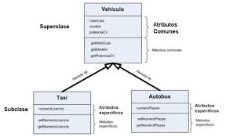

# Extender la clase Mascota

**Objetivo**: Identificar métodos con parámetros y retorno, y aplicar encapsulamiento.
Indicaciones:

## Dibujen un diagrama en el cuaderno:

Mascota

- nombre: string (privado)
- edad: int (privado)
- tipo: string (privado)
+ emitirSonido(): void
+ mostrarInfo(): void
+ getEdad(): int
+ setEdad(int nuevaEdad): void
+ calcularEdadHumana(): int

Puedes seguir el siguiente ejemplo:


1. Sube una captura de pantalla a la plataforma.


## Pseudocódigo

2. En parejas o individual, modifiquen su pseudocódigo agregando los métodos getEdad, setEdad, calcularEdadHumana.

Ejemplo:

```
Método calcularEdadHumana
  edadHumana = edad * 7
  retornar edadHumana
```

## Programación en C#

3. Usa como base el código de la práctica pasada.

2. Agregar método `setEdad`


3. Explica cómo llamar cada método desde Main y qué esperar de cada uno.

2. Ejemplo en Main 

```c#
class Program
{
    static void Main(string[] args)
    {
        Mascota m = new Mascota("Firulais", 3, "perro");
        m.MostrarInfo();
        Console.WriteLine("Edad humana: " + m.CalcularEdadHumana());

        m.SetEdad(5);
        Console.WriteLine("Nueva edad: " + m.GetEdad());
    }
}
```

4. Crear 2 mascotas con diferentes edades y tipos.

5. Llamar todos los métodos.

6. Cambiar la edad de una mascota usando setEdad.

7. Mostrar la edad humana antes y después del cambio.

8. Responde en la plataforma
¿Cuál fue la parte más difícil?

¿Qué pasa si no usamos get o set?

¿Para qué sirve retornar algo?

