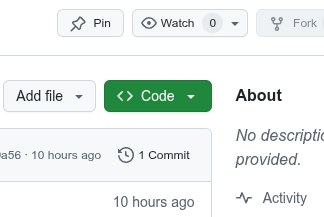

9# Enlazar repositorios con archivos

[Imagen de referencia]: #

## ¿Cuándo usarlo?

Cuando tengo archivos **con nombres diferentes**

## Requisitos

1. Cuenta de GitHub
2. Tener Git Bash en tu computadora
3. Tener configuradas tus credenciales. Puedes seguir [este tutorial.]()
4. Tokeb de GitHub (opcional) Puedes ver este tutorial para generarlo.

## Instrucciones

### Paso 1: obten el enlace HTTP de tu git



### Paso 2: Inicializa Git en tu computadora

1. Abre la carpeta de tu repositorio.
2. Abre el Git Bash aquí.
3. Usa el comando ```git init```.

[Imagen de referencia.]: #

### Paso 3: clona el repositorio

3. Vuelve a enlazar el repositorio remoto (usa tu URL real, la puedes copiar de GitHub con el botón "Code"):

git remote add origin https://github.com/TuUsuario/TuRepositorio.git


4. Recupera el historial remoto (si quieres comparar o hacer pull):

git fetch origin

(Opcional, pero útil si el repositorio remoto tiene commits previos)


5. Si tu rama principal se llama main, asegúrate de crearla:

git checkout -b main


6. Agrega tus archivos al seguimiento de Git:

git add .


7. Haz un nuevo commit con tus cambios:

git commit -m "Reconectando proyecto con el repositorio después de perder .git"


8. Fuerza el push (⚠️ cuidado, solo si estás segura de que quieres sobrescribir el remoto):

git push -u origin main --force
